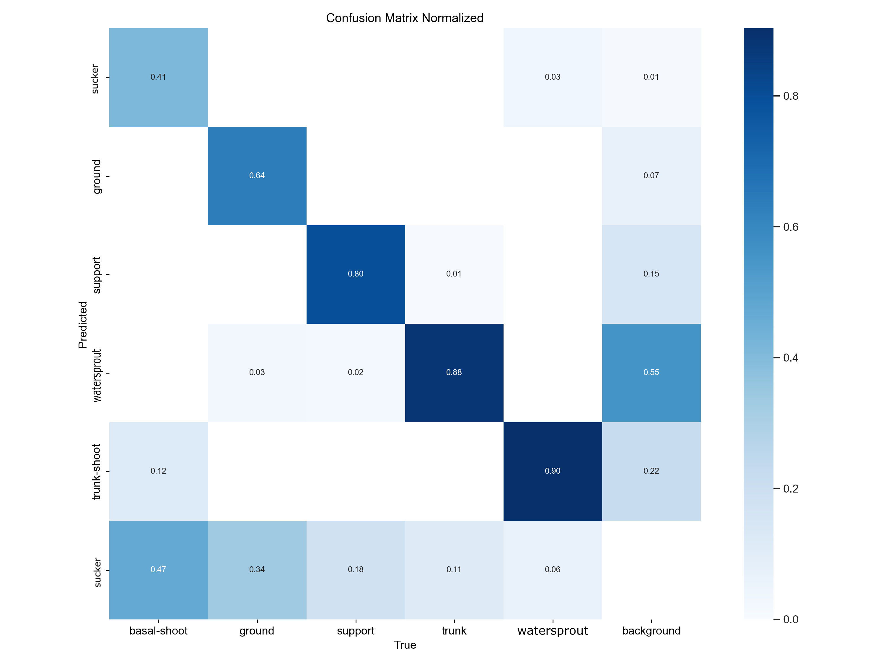

# 🍇 Automatic Detection of Suckers and Watersprouts in Grapevines  
## 🤖 Computer Vision for Robotic Suckering

This repository contains the resources and materials developed for a thesis project on the automatic detection of suckers and watersprouts (undesired shoots) in grapevines, using state-of-the-art computer vision techniques. The system leverages YOLOv11-Seg instance segmentation models to support automated suckering operations in vineyards.

---

### 📂 Repository Contents

- 🗂️ **best.pt** — Trained weights of the YOLOv11-Seg model achieving the best performance.
- 📊 **presentation.pptx** — Brief PowerPoint presentation summarizing the project, methodology, and main results.
- 📥 **dataset** — The full dataset is **not stored directly in this repository** due to file size restrictions.  
  Instead, you can download it from Zenodo (see below).

---

### 📥 Download the Dataset

Due to GitHub file size restrictions, the full dataset is hosted externally on Zenodo.

Download it here:  
➡️ [Automatic Detection of Suckers and Watersprouts – dataset (Zenodo)](https://zenodo.org/records/16020164)

## 🌱 Project Overview

Suckering is a fundamental operation in vineyard management: it involves removing non-productive shoots (suckers and watersprouts) that grow from the base or trunk of the vine, competing for vital resources and negatively affecting yield quality.

This project presents a computer vision system designed to automatically detect these undesired shoots in the lower part of the vine. The workflow includes:

- 🧑‍🌾 **Dataset creation**: Field data collection in a Tuscan vineyard, frame extraction, and multi-class manual/automatic annotation using Roboflow and the SAM2 model.
- 🧠 **Model training**: Fine-tuning a YOLOv11-Seg instance segmentation model on the custom dataset (PSV-Seg), experimenting with data augmentation and preprocessing strategies.
- 📈 **Evaluation**: Performance measured via precision, recall, F1-score, and confusion matrices, with detailed analysis of class-wise results and model limitations.

The project materials can be used as a starting point for further development of robotic platforms for autonomous suckering, and as a dataset benchmark for future computer vision research in precision agriculture.

---

---

## 📊 Example: Model Performance

Below is the normalized confusion matrix obtained on the test set using the best YOLOv11-Seg model:

  

*Confusion matrix showing class-wise segmentation performance.*

---

## ⚡ How to Use

1. 📥 **Download and unzip** the dataset if you wish to train or test models.
2. 🏋️‍♂️ **Use the provided weights** (`best.pt`) with YOLOv11-Seg-compatible code to run inference or continue fine-tuning.
3. 📑 **Refer to the PowerPoint presentation** for a quick overview of objectives, methodology, results, and possible future directions.

---

### 🔄 Model Fine-Tuning

The provided `best.pt` weights can be used as a starting point for further fine-tuning on new datasets or under different conditions.  
**To improve the detection of suckers (polloni), it is highly recommended to further expand the dataset with additional annotated images containing suckers, especially in varied lighting and environmental conditions.**

## 📖 Citation

If you use this dataset or code, please cite:  
**Paolo Strianese**, "Automatic detection of suckers and watersprouts in grapevines: computer vision system for agricultural robots", University of Milano-Bicocca, 2025.

---

## 📬 Contact

For more information:  
**Paolo Strianese**  
paolostria@gmail.com
